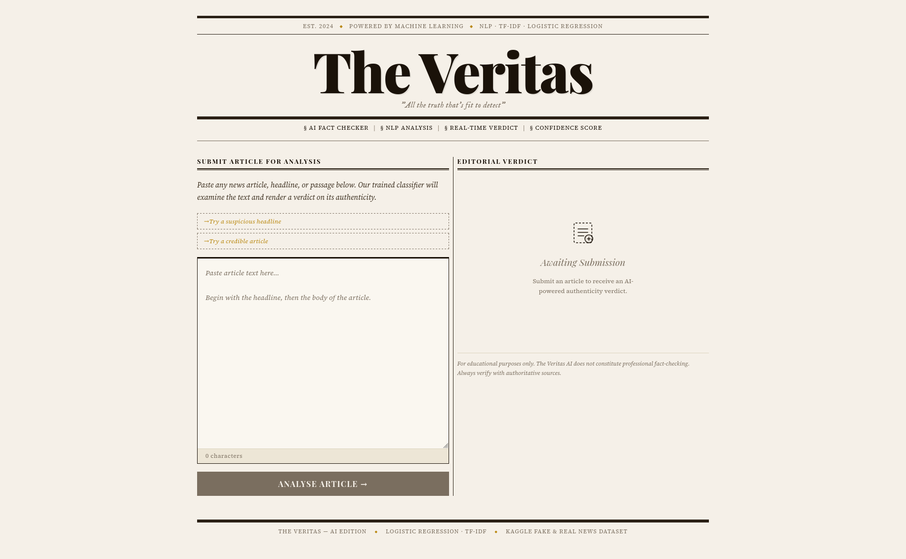

# Fake News Detection — AI

Detects whether a news article is **FAKE** or **REAL** using NLP and machine learning.



---

## Dataset

Kaggle — [Fake and Real News Dataset](https://www.kaggle.com/datasets/clmentbisaillon/fake-and-real-news-dataset) by Clément Bisaillon

Download `Fake.csv` and `True.csv` and place them in the `data/` folder inside the project. This folder is gitignored _(each contributor must download the dataset locally)_.

---

## Getting Started

> **New to this?** Follow every step in order and don't skip anything. If something goes wrong, check the [Troubleshooting](#troubleshooting) section at the bottom.

### Step 1 — Install the prerequisites

You need two programs installed before anything else:

- **Python 3.10+** → download from [python.org](https://www.python.org/downloads/)
  - ⚠️ During install on Windows, check the box that says **"Add Python to PATH"**
- **Node.js 22+** → download from [nodejs.org](https://nodejs.org/)

To verify they installed correctly, open a terminal and run:
```
python --version
node --version
```
Both should print a version number.

---

### Step 2 — Download the project

Download or clone this repository to your computer. You should end up with a folder called `Fake-news-detection-ml-project-main`. Remember where you saved it.

---

### Step 3 — Open a terminal in the project folder

**On Windows:**
1. Open the folder in File Explorer
2. Click the address bar at the top, type `cmd`, and press Enter
3. A Command Prompt window will open already inside the project folder

**On Mac/Linux:**
1. Open Terminal
2. Type `cd ` (with a space), then drag the project folder into the terminal and press Enter

---

### Step 4 — Download the dataset

1. Go to the [Kaggle dataset page](https://www.kaggle.com/datasets/clmentbisaillon/fake-and-real-news-dataset) (you may need a free Kaggle account)
2. Download `Fake.csv` and `True.csv`
3. Place both files inside the `data/` folder in the project

---

### Step 5 — Set up Python environment

This creates an isolated Python environment just for this project so it doesn't interfere with anything else on your computer.

**On Windows (Command Prompt):**
```
python -m venv .venv
.venv\Scripts\activate
pip install -r requirements.txt
```

**On Mac/Linux:**
```bash
python -m venv .venv
source .venv/bin/activate
pip install -r requirements.txt
```

> ✅ You'll know the environment is active when you see `(.venv)` at the start of your terminal line.

---

### Step 6 — Install frontend dependencies

```
cd frontend && npm install && cd ..
```

This downloads the packages needed for the web interface. It only needs to be done once.

---

### Step 7 — Run the app

**On Mac/Linux**, you can use the start script which handles everything automatically:
```bash
source .venv/bin/activate
./start.sh
```

**On Windows**, run each part manually. You'll need **3 separate Command Prompt windows**:

First, activate the environment in each window before running commands:
```
.venv\Scripts\activate
```

**Window 1 — Train the model** (only needed the first time):
```
python -m ml.train.main
```
Wait for it to finish before moving on.

**Window 2 — Start the ML backend:**
```
.venv\Scripts\activate
uvicorn ml.service.main:app --port 8000
```

**Window 3 — Start the frontend:**
```
cd frontend
npm run dev
```

---

### Step 8 — Open the app

Once everything is running, open your browser and go to:

- 🌐 **Frontend (the app):** http://localhost:5173
- 🔧 **ML service (API):** http://localhost:8000

To stop the app, go back to your terminal windows and press `Ctrl + C` in each one.

---

## Project Structure

```
ml/
  train/         # training pipeline
  service/       # FastAPI prediction service (port 8000)
  preprocess.py  # shared text cleaning
frontend/        # React + Vite UI (port 5173)
data/            # gitignored — download from Kaggle
outputs/         # gitignored — generated by training
```

---

## Troubleshooting

**`'source' is not recognized`**
You're on Windows. Use `.venv\Scripts\activate` instead of `source .venv/bin/activate`.

**`'.' is not recognized` when running `./start.sh`**
The start script is for Mac/Linux only. Follow the Windows manual steps in Step 7 above.

**`ModuleNotFoundError: No module named 'pandas'`**
Your virtual environment isn't active. Run `.venv\Scripts\activate` (Windows) or `source .venv/bin/activate` (Mac/Linux), then run `pip install -r requirements.txt` again.

**`FileNotFoundError: outputs/model.pkl`**
The model hasn't been trained yet. Run `python -m ml.train.main` first.

**`Error: dataset not found in data/`**
Make sure `Fake.csv` and `True.csv` are inside the `data/` folder in the project root.

**Script won't run on Windows PowerShell** (Execution Policy error)
Switch to Command Prompt (`cmd`) instead of PowerShell, or run:
```
Set-ExecutionPolicy -ExecutionPolicy RemoteSigned -Scope CurrentUser
```
